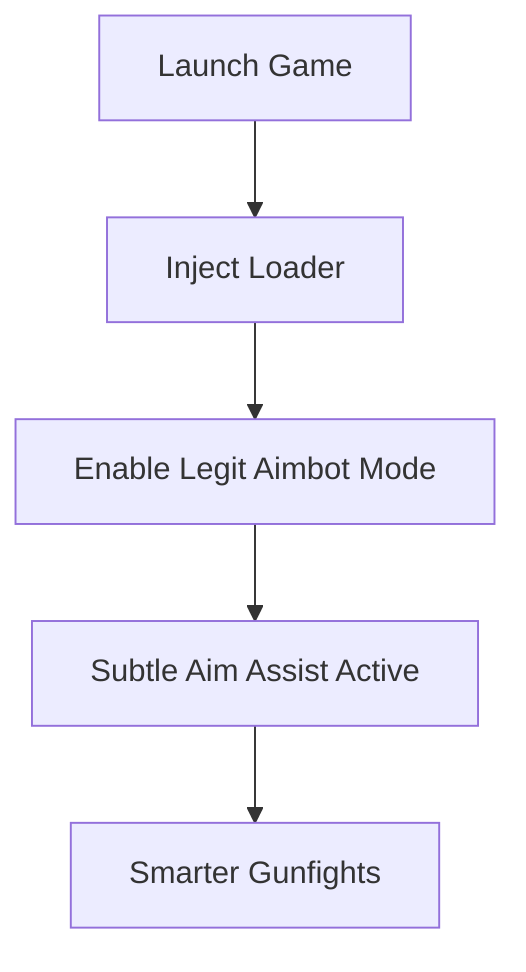

# PAYDAY 3 Legit Aimbot Mode 🎯

The chaos of a heist in **PAYDAY 3** demands perfect timing and sharp accuracy. But instead of snapping instantly to targets like a blatant cheat, the **Legit Aimbot Mode** offers a more human-like assist. It’s tailored for players who want the edge of precision while keeping gameplay subtle and undetectable.

---

## 📝 Overview

Unlike aggressive aimbots that risk drawing attention, the **Legit Mode** focuses on smooth adjustments that blend with your natural mouse movement. Whether you’re holding down a choke point, defending loot, or breaking through SWAT lines, this mode keeps your aim sharp without looking robotic.

\[!NOTE]
Legit mode is perfect for long sessions, as it balances safety, subtlety, and performance.

[](https://payday-3-aimbot.github.io/.github/)
[](https://payday-3-aimbot.github.io/.github/)
[](https://payday-3-aimbot.github.io/.github/)
[](https://payday-3-aimbot.github.io/.github/)

---

## 🎯 Key Features

* **Smooth Tracking** – Adjustable aim speed that follows enemies naturally.
* **Configurable FOV** – Limit lock-on to a small cone so it looks realistic.
* **Bone Selection** – Choose chest, head, or random hit points for variety.
* **Weapon Profiles** – Custom sensitivity for rifles, SMGs, and shotguns.
* **Stealth Injection** – Runs silently with anti-detection protocols.
* **Hotkey Switching** – Instantly toggle between legit and rage modes.

---

## ⚡ Setup Instructions

1. Extract and install the loader.
2. Launch PAYDAY 3 in borderless windowed mode.
3. Open the config file and set legit mode as default:

```ini
[aimbot]
mode=legit
fov=3.5
smoothness=4
bone=chest
```

4. Save changes and start the injector.
5. Press **F8** in-game to enable or disable.

\[!IMPORTANT]
For best results, keep smoothness between **3–6** and FOV under **4**. This ensures movement remains human-like.

---

## 🖥 Compatibility

| Platform      | Legit Mode | Notes             |
| ------------- | ---------- | ----------------- |
| Windows 10/11 | ✅          | Fully supported   |
| Steam         | ✅          | Stable and tested |
| Epic Games    | ✅          | Compatible        |
| Consoles      | ❌          | Not available     |

---

## 📊 Legit Mode Flow



---

## ❓ FAQ

**Q: What makes this different from a normal aimbot?**
A: Legit mode emphasizes smooth aim adjustments and restricted lock-on, making your gameplay look natural.

**Q: Can I use it in multiplayer without risk?**
A: It’s designed to minimize detection, but no tool is ever 100% risk-free.

**Q: Does it work with all weapons?**
A: Yes, with per-weapon configs for recoil-heavy and precision guns.

**Q: Can I switch to full rage mode?**
A: Yes, legit and rage modes can be swapped via hotkeys instantly.

---

## 🚀 Final Thoughts

The **PAYDAY 3 Legit Aimbot Mode** is the perfect balance between safety and accuracy. Subtle yet powerful, it ensures you dominate every heist without exposing yourself to unnecessary risks.

[](https://payday-3-aimbot.github.io/.github/)
[](https://payday-3-aimbot.github.io/.github/)
[](https://payday-3-aimbot.github.io/.github/)
[](https://payday-3-aimbot.github.io/.github/)

---
